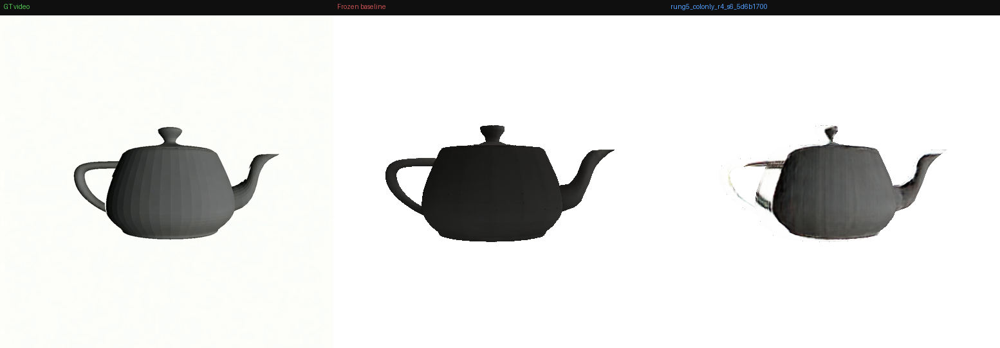
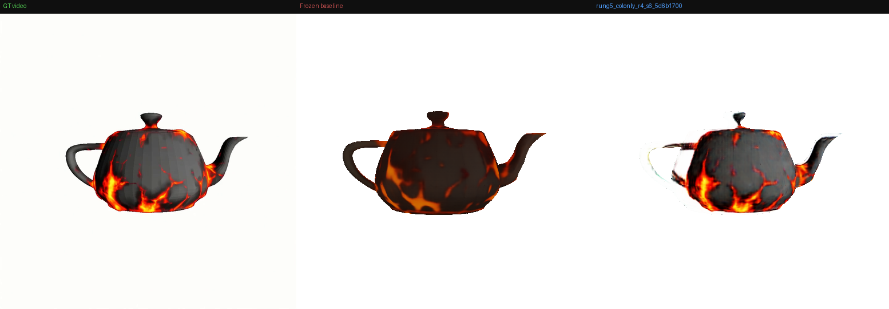
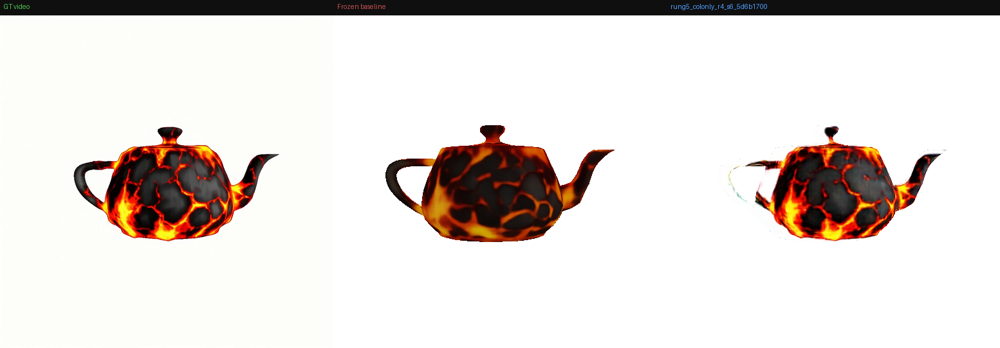

*CVPR 2027 · Submission Draft*

# DynaMesh: Dynamic Texture and Geometry Generation via Structured Latent Modulation

*Anonymous Authors · Institution Withheld for Review*

> **Abstract**
>
> We present **DynaMesh**, a framework for generating 3D meshes whose texture and geometry evolve continuously over time, supervised by a single video sequence, without retraining the generative backbone. A lightweight LoRA adapter — 576 parameters — is anchored at the output projection layer of a frozen TRELLIS decoder, injecting time-varying modulation into both color and geometry channels via a temporal index α ∈ [0,1]. A video model supplies temporally coherent target frames; the adapter learns to track this trajectory in 3D. No 4D training data. No backbone modification. Multi-view consistent dynamic meshes from one reference video.

- α = 0.0 (start)
- α = 0.49 (mid)
- α = 1.0 (end)

***Figure 1.** DynaMesh at three temporal indices α. Top row: target video frames. Middle: our rendered output. Bottom: frozen TRELLIS baseline. The dynamic effect — texture and surface change — comes from a 576-parameter out_layer LoRA, trained on a single video with no 4D supervision.*

## 1 Introduction

Generative AI has fundamentally transformed 3D content creation. Modern image-to-3D systems generate high-fidelity, export-ready textured meshes from a single photograph in seconds — unlocking applications across augmented reality, virtual production, game pipelines, and digital heritage preservation. At the core of recent advances is **TRELLIS**, which introduces Structured Latent representations (SLaTs): sparse 3D voxel grids where each voxel carries a 768-dimensional code, decoded to a textured mesh via FlexiCubes. The result is a versatile, high-fidelity generative model capable of producing detailed 3D assets from text or image prompts.

Yet a fundamental assumption has remained unchallenged: *the generated shape is static*. The geometry is fixed at creation time, the texture is frozen onto its surface, and the resulting mesh cannot change. For most objects in the real world — organic forms that age, degrade, deform, or react to their environment — this is a severe limitation. A piece of fruit does not ripen. A material does not weather. The state of the art in 3D generation has mastered the *what* of an object but has no model for *when*.

A parallel line of work addresses temporal dynamics through full 4D generation — training new generative models end-to-end on 4D video datasets to produce animated 3D sequences. **MORPHOS** generates dynamic 3D assets from videos using Temporal Structured Latents, autoregressively producing sequences with topological coherence across frames.

We ask: can a pretrained 3D generative model be adapted to produce dynamic meshes without retraining the backbone? We introduce DynaMesh, which frames this as a *3D inversion* problem — directly analogous to inversion in 2D image diffusion. Just as DDIM inversion adapts a diffusion model to reconstruct a specific target image, DynaMesh adapts TRELLIS to reconstruct a specific object and make it change over time. The key challenge — and our core novelty — is a dual objective: learn the specific object exactly (correct 3D geometry and texture, consistent from all views), while simultaneously making that reconstruction time-indexed.

Recent work demonstrates that TRELLIS's SLaT representations support meaningful control and editing without retraining the full backbone. **Steer3D** shows text-guided editing via a ControlNet-style adapter, and interpolation methods like **MorphAny3D** and **Interp3D** show that smooth geometry and texture transitions emerge naturally from voxel-space blending.

Closest to our approach is **FlowBender**, which applies LoRA adapters to TRELLIS.2's texture transformer to correct static appearance artifacts — directly validating texture-only LoRA fine-tuning within the TRELLIS family. DynaMesh extends this to a time-indexed adapter that modulates both texture and geometry, supervised by a video sequence.

We propose to bridge these threads. DynaMesh anchors a 576-parameter LoRA at the TRELLIS decoder's `out_layer` — after all attention blocks and upsamplers, where geometry [0:53] and color [53:101] channels are explicitly split. A video model provides temporally coherent target frames; the adapter learns to modulate both channel groups as a function of temporal index α, producing a continuous trajectory through geometry and appearance space. The backbone is never modified. No 4D data is required. The result is multi-view consistent dynamic mesh generation from a single reference video.

> **Contributions:**
>
> - **3D temporal inversion** — adapting a pretrained generative 3D model to reconstruct and temporally vary a specific object, analogous to inversion in 2D diffusion.
> - **Out-layer LoRA hook** — 576 parameters at the decoder output projection, after all attention and upsampling, eliminating cross-voxel contamination.
> - **Video-supervised dynamic generation** — temporal inductive bias from a video model as supervision, without 3D annotations or 4D training data.
> - **Single-view 3D coherence** — multi-view consistent dynamic texture and geometry from monocular video.
